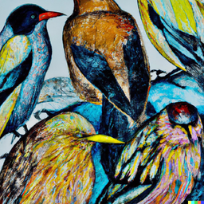

# b i r b s
`rad:git:hnrkpejps6hiqz46jdg4rta68p3w7d6ibuyko`

`birbs` are cute little creatures that are always looking for a place to live. They Flutter their wings and fly around the world.

- **[roisoleil](https://github.com/Plurigrid/birbs/blob/main/roisoleil/bin/roisoleil.dart#L21)**: adds [Junø](https://docs.junonetwork.io/juno/readme) and CosmWasm support to [Alan SDK](https://alan-sdk.github.io/alan.dart/)
- **[corvus](https://github.com/Plurigrid/birbs/blob/main/corvus):** this birb can [cosmos_sdk_proto::cosmwasm](https://docs.rs/cosmrs/latest/cosmrs/) to query CosmWasm contracts from native apps, and other Cosmos diversions accessible from Dart using [ffi](https://pub.dev/packages/ffi) and [flutter_rust_bridge](https://github.com/fzyzcjy/flutter_rust_bridge/blob/6b18afaa5f2a7303544b3e51ff738f1c6f0d2655/book/src/contributing/architecture.md#user-content-fnref-1-2-e19c48f74dd148f1e563271f80801252) 🌉
- **counterpoints**: adds [walletconnect-dart](https://pub.dev/packages/walletconnect_dart) to [GetX](https://pub.dev/packages/get)
- `TODO`: add [r2frida](https://github.com/nowsecure/r2frida) example for mobile birbs
- `TODO`: add [libp2p](https://docs.rs/libp2p/latest/libp2p/swarm/index.html) +  example, its field use elaborated w/ [mockito](https://pub.dev/packages/mockito) for trustless birb discovery
- `TODO`: Handshake [hnsd](https://github.com/handshake-org/hnsd) + [dart:ffi](https://dart.dev/guides/libraries/c-interop)

## learn 📚
- [Learning Dart as a JavaScript developer](https://dart.dev/guides/language/coming-from/js-to-dart)

- [CSS style to Flutter code](https://github.com/drawcall/c2f)
